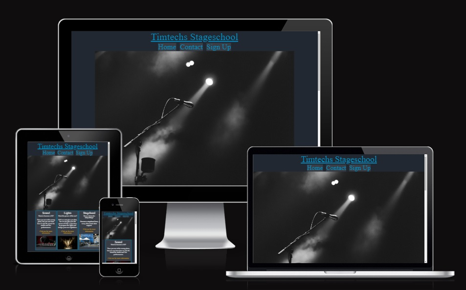

# Timtechs Stageschool

Timtechs Stagschool is for anyone who is intrested in joining the event bussiness or just to have a fun hobby. The school is based in Stockholm, Sweden. The site is mostly about the different courses.

# Features

## Existing Features

* Navigation bar
    * Featured on all five pages, the navigation bar includes links to the Home oage, Contact page and Sign Up page (some links are not included on all pages)
    * This allows the user to navigate easily through the website on all devices without using back button.

* Landing page image
    * The landing includes a title and a image fitting for the site.
    * This image hopes to inspire the user to sign up by being abit raw and unusual for the audience.

* Course section
    * The course section includes all the avalible courses of the page.
    * The user will see some witty comments that is also giving some information about the courses.

* Video section
    * This section hopes to inspire the user to apply to one of the courses by showing a short video from a cirkus show that the founder worked on.

* Contact information
    * This is just for contacting us

* The footer
    * The footer includes links to relevant social media. The links open in a new tab for easy navigation.
    * The footer is valuable to the user to stay connected with us om social media

* The sound page
    * The soundpage offers some more information about the course and a sign up button which leads to the signup page.
    * This page is valuable to the user for deciding to take the course.

* The lights page
    * The lights page offers some more information about the course and a sign up button which leads to the signup page.
    * This page is valuable to the user for deciding to take the course.

* Sign Up page
    * This page have a form to create an account to the website
    * There is also a confirmation page for when you have joined

## Features left to implement

* Stagehand, Dance, Sing and Acting pages
* Images for the courses to stick to the bottom of the box
* Contact link that takes you to the contact section on the homepage
* Side menu so you kan reach everything from all pages
* More videos to show different types of show/work

## Testing

* Validator Testing
    * No errors were returned when passing throught the official [W3C validator](https://validator.w3.org/nu/?doc=https%3A%2F%2Ftimtechs.github.io%2FCI-Project-1%2F)
    * No errors were returned when passing throught the official [(jigsaw) validator](https://jigsaw.w3.org/css-validator/validator?uri=https%3A%2F%2Ftimtechs.github.io%2FCI-Project-1%2F&profile=css3svg&usermedium=all&warning=1&vextwarning=&lang=sv)

* Screen size test
    * Tested the screen sizes on Samsung Galaxy Fold, Samsung Galaxy S20 Ultra, Ipad Air and a 1920x1080 screen
    * Made an image on [Am I Responsive](https://ui.dev/amiresponsive?url=https://timtechs.github.io/CI-Project-1/) to easier to see the different sizes.

## Unfixed Bugs

* Footer on Sign Up page is not on the bottom, it remains unfixed because i havent found the reason for why it acts differently than the rest. 

## Deployment

* The site was deployed to GitHub pages. The steps to deploy are as follows
    * In the GitHub repository, navigate to the Settings tab
    * From the source section drop-down menu, select the Master Branch
    * Once the master branch has been selected, the page will be automatically refreshed with a detailed ribbon display to indictate the successful deployment.

Link to the live version - https://timtechs.github.io/CI-Project-1/

## Credits
* Icons: Font Awesome
* Code inspiration:
    * [Love Running](https://github.com/Timtechs/love-running) for basic structure on HTML
    * [W3schools](https://www.w3schools.com/howto/howto_css_signup_form.asp) for signup form and for [Media Queries](https://www.w3schools.com/Css/css3_mediaqueries_ex.asp)
    * [Kevin Powell](https://www.youtube.com/watch?v=8QSqwbSztnA&t=438s&ab_channel=KevinPowell) for grid
    * [Stackoverflow](https://stackoverflow.com/questions/54967009/make-item-on-css-grid-a-hyperlink) for courses links
    * [Freecodecamp](https://www.freecodecamp.org/news/how-to-keep-your-footer-where-it-belongs-59c6aa05c59c/) for footer position
    * [Simplehtmlguide](http://www.simplehtmlguide.com/youtube.php) for embedded video
I made some twists and turns on the code from above sources too fit my needs

## Media

All imgaes used on this page is from [Pixabay](https://pixabay.com/)

Video used on this page is from a cirkus company called [Burnt Out Punks](https://www.youtube.com/user/burntoutpunks). I am allowed to use these videos for personal or commercial use.